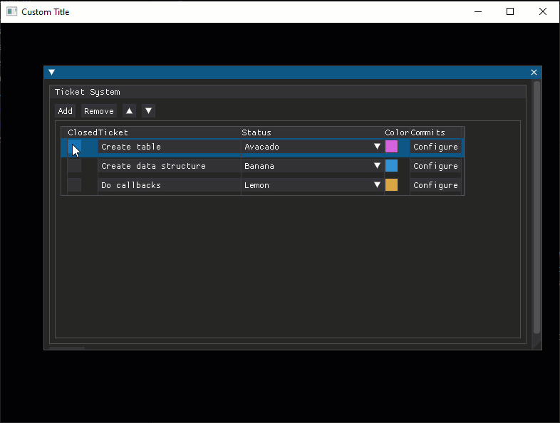

# DPG SwissControls

Some widgets for DearPyGui

## Install

In python, if you want to import some code into another project, you might do that with `import pandas as pd`. If you don't have the pandas package _installed_, then the import statement will fail. The same goes if you want to import swisscontrols into your project: it needs to be installed. 

### Build locally

> Instructions based on [this guide](https://learn.scientific-python.org/development/guides/packaging-simple/)

1. `py -m pip install build hatchling`. 
2. Navigate to the project root directory in terminal and run `py -m build`. This will create distribution packages in the `dist` directory. 
3. Run `py -m pip install path\to\dist\swisscontrols-0.0.1-py3-none-any.whl`

## List Edit Ctrl

Add, remove, sort, and edit elements in a list. 

